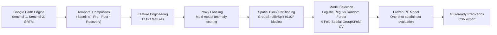

# 🌊 Nepal Flood — EO-Based Landscape Change Detection


Multi-sensor Earth Observation pipeline and spatial machine learning model for detecting flood and landslide impacts in Nepal's **Bhote Koshi – Trishuli river basin**, using Sentinel-1 SAR, Sentinel-2 optical imagery, and SRTM topographic data — evaluated under strict **spatial block cross-validation** to prevent autocorrelation leakage.

---

## Why This Exists

In late August 2026, extreme monsoon flooding devastated central Nepal. Emergency responders need rapid, accurate maps of landscape change — but field validation is slow and dangerous. This project builds an automated change-detection pipeline that:

1. Ingests multi-temporal Sentinel-1 SAR and Sentinel-2 optical composites (pre-flood, post-flood, baseline, and recovery windows) via **Google Earth Engine**.
2. Derives 17 remote sensing features (radar backscatter, spectral indices, terrain attributes) and aligns them to a common 30 m reference grid.
3. Generates proxy ground-truth labels via multi-modal standardized anomaly scoring (top 20% composite change score → `Y = 1`).
4. Trains and evaluates a **Random Forest** classifier under spatially rigorous block-based partitioning — ensuring the model is tested on geographic regions it has never seen during training.

The resulting prediction CSV (`longitude`, `latitude`, `Y_pred`, `P_change`) is formatted for direct GIS handoff and downstream mapping.

---

## How It Works



---

## Results at a Glance

### Spatial Cross-Validation (4-Fold GroupKFold on 80% Dev Set — all 17 features)

| Model | Accuracy | Precision | Recall | F1 | IoU | ROC-AUC |
|---|---|---|---|---|---|---|
| Logistic Regression | 0.7121 ± 0.0750 | 0.3790 ± 0.0330 | 0.6840 ± 0.1432 | 0.4823 ± 0.0280 | 0.3181 ± 0.0239 | 0.7686 ± 0.0240 |
| **Random Forest** | **0.9792 ± 0.0028** | **0.9259 ± 0.0099** | **0.9710 ± 0.0105** | **0.9479 ± 0.0048** | **0.9010 ± 0.0087** | **0.9981 ± 0.0003** |

### Held-Out Spatial Test (20% — 6 unseen geographic blocks, 29,351 pixels)

| Model | Accuracy | Precision | Recall | F1 | IoU | ROC-AUC |
|---|---|---|---|---|---|---|
| **Random Forest (Frozen)** | **0.9844** | **0.9411** | **0.9873** | **0.9637** | **0.9299** | **0.9991** |

### Multi-Sensor Ablation (Spatial Test Partition)

| Experiment | Features | Accuracy | Precision | Recall | F1 | IoU | ROC-AUC |
|---|---|---|---|---|---|---|---|
| S1 SAR Only | 6 | 0.8000 | 0.5167 | 0.6902 | 0.5910 | 0.4195 | 0.8497 |
| S1 + S2 (Optical) | 15 | 0.9827 | 0.9352 | 0.9857 | 0.9598 | 0.9227 | 0.9990 |
| **S1 + S2 + Terrain (Full)** | **17** | **0.9844** | **0.9411** | **0.9873** | **0.9637** | **0.9299** | **0.9991** |

> [!NOTE]
> All metrics above are taken directly from notebook outputs in [`02_EO_Spatial_ML_Change_Detection.ipynb`](Notebooks/02_EO_Spatial_ML_Change_Detection.ipynb) and [`Data/ablation_results.csv`](Data/ablation_results.csv).

---

## Quickstart

### Prerequisites
- Python **3.11** (verified from `.venv` kernel metadata)
- A Google Earth Engine project with authenticated credentials (required only for Notebook 01 — data re-acquisition)

### Setup

**Windows (PowerShell)**
```powershell
py -3.11 -m venv .venv
.venv\Scripts\activate
python -m pip install --upgrade pip
pip install -r requirements.txt
```

**macOS / Linux**
```bash
python3.11 -m venv .venv
source .venv/bin/activate
python -m pip install --upgrade pip
pip install -r requirements.txt
```

### Run

1. **Stage 1 — Data Acquisition** (requires Google Earth Engine credentials):
   Open and run [`Notebooks/01_Data_Setup.ipynb`](Notebooks/01_Data_Setup.ipynb).
   This downloads Sentinel-1, Sentinel-2, and SRTM GeoTIFFs, builds the feature table, and generates proxy labels.

2. **Stage 2 — Spatial ML & Evaluation** (can run with pre-generated data):
   Open and run [`Notebooks/02_EO_Spatial_ML_Change_Detection.ipynb`](Notebooks/02_EO_Spatial_ML_Change_Detection.ipynb).
   This performs spatial block partitioning, cross-validation, model comparison, ablation, and exports predictions.

> [!TIP]
> If you already have the `Data/` files (GeoTIFFs, CSVs), you can skip Notebook 01 entirely and jump straight to Notebook 02.

---

## Repo Map

```
Nepal_Flood/
├── Notebooks/
│   ├── 01_Data_Setup.ipynb                    # EO extraction, alignment, feature table, proxy labeling
│   └── 02_EO_Spatial_ML_Change_Detection.ipynb # Spatial ML: CV, model selection, ablation, export
│
├── Module/
│   ├── __init__.py                            # Package init
│   ├── data_prep.py                           # Earth Engine utilities, raster alignment, feature table builder, proxy labeling
│   └── spatial_ml.py                          # Spatial blocks, GroupShuffleSplit, leakage checks, CV, ablation, export
│
├── configs/
│   ├── ml_config.json                         # Central hyperparameters, feature groups, split ratios, paths
│   └── time_metadata.json                     # Temporal windows: baseline, pre, post, recovery
│
├── Data/                                      # Generated artifacts (gitignored except .gitkeep)
│   ├── S1_pre.tif, S1_post.tif, S1_2025_baseline.tif   # Sentinel-1 SAR composites
│   ├── S2_indices_change.tif                            # 9-band Sentinel-2 indices
│   ├── DEM.tif                                          # SRTM 30m DEM
│   ├── EO_feature_table_unlabeled.csv                   # Raw 17-feature matrix
│   ├── EO_feature_table_labelled.csv                    # With proxy target Y (123,154 rows)
│   ├── EO_feature_table_spatial_split.csv               # With spatial block + split labels
│   ├── ablation_results.csv                             # Multi-sensor ablation metrics
│   ├── RF_spatial_test_predictions.csv                  # GIS-ready test predictions
│   ├── random_forest_final.joblib                       # Serialized frozen RF model (~90 MB)
│   └── random_forest_final.json                         # Model metadata
│
├── docs/
│   ├── methodology.md                         # Problem formulation, labeling strategy, spatial CV design
│   ├── data-and-features.md                   # Data provenance, feature engineering details
│   └── results.md                             # Full metric tables, ablation, and failure modes
│
├── requirements.txt                           # Python dependencies
├── LICENSE                                    # MIT License
├── .gitignore                                 # Ignores Data/, .venv/, caches
└── README.md                                  # ← You are here
```

---

## Docs Index

| Document | What You'll Find |
|---|---|
| [`docs/methodology.md`](docs/methodology.md) | Problem formulation, why Random Forest over Logistic Regression, spatial CV design, proxy labeling rationale, cost-of-error analysis |
| [`docs/data-and-features.md`](docs/data-and-features.md) | Data provenance (Sentinel-1/2, SRTM), temporal windows, feature engineering, spatial alignment, missing-value handling |
| [`docs/results.md`](docs/results.md) | Full metric tables (CV + test), multi-sensor ablation, confusion matrix analysis, feature importance, failure modes |

---

## Limitations

- **Proxy labels, not ground truth.** The binary target `Y` is derived from a multi-modal standardized anomaly score (top 20% percentile threshold). It is *not* independently validated field data. The model learns to reproduce an EO-derived rule, not to detect floods from first principles.
- **Single AOI.** All data covers one ~4 × 28 km bounding box (84.70°–85.00°E, 28.00°–28.25°N). Geographic generalization to other basins or countries has not been tested.
- **No temporal hold-out.** The temporal window is fixed (Aug–Sep 2026); the model has not been evaluated on future or historical flood events.
- **80/20 class split is deterministic.** The 80th-percentile threshold produces an exact 80/20 class balance by construction. Performance on a real-world imbalanced class distribution may differ.
- **Sentinel-2 cloud contamination.** The `CLOUDY_PIXEL_PERCENTAGE < 80` filter is lenient. Monsoon cloud cover can degrade optical index quality; SAR features are cloud-penetrating and more reliable in this context.

---

## License

[MIT License](LICENSE) — Copyright © 2026 Biswarup Majumdar

---

## Citation

If you use this work, please cite:

```
Majumdar, B. & Das, A. (2026). Nepal Flood — EO-Based Landscape Change Detection.
GitHub: https://github.com/Mr-Rup/Nepal_Flood
```

---

## Contact

**Biswarup Majumdar** — [GitHub](https://github.com/Mr-Rup)  
**Abhilasha Das** — [GitHub](https://github.com/abhilashaxdata)
