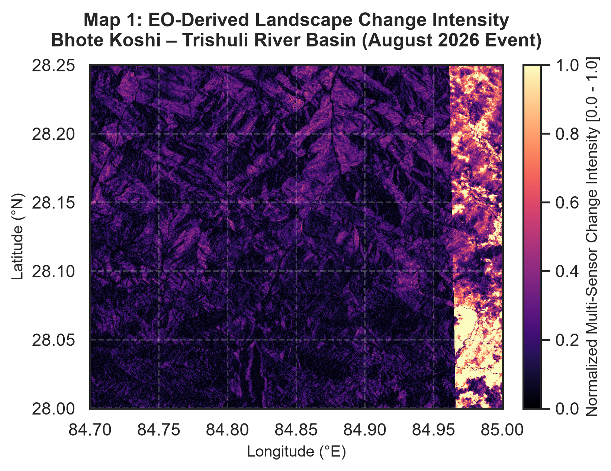
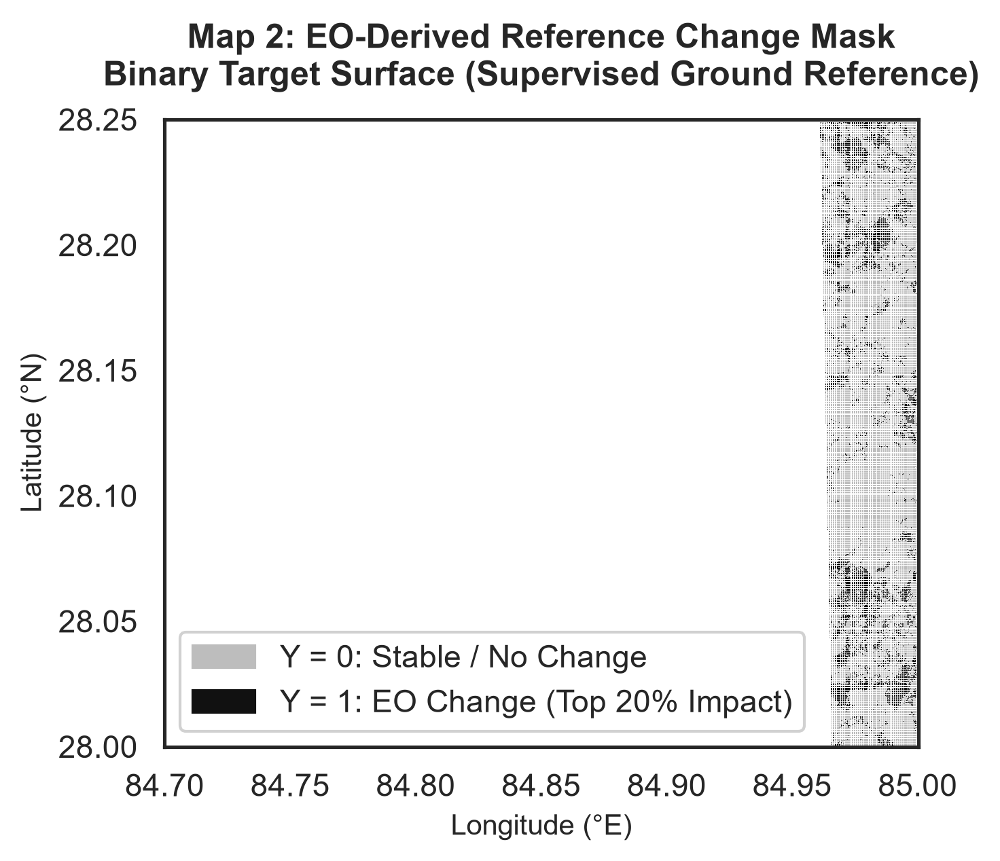
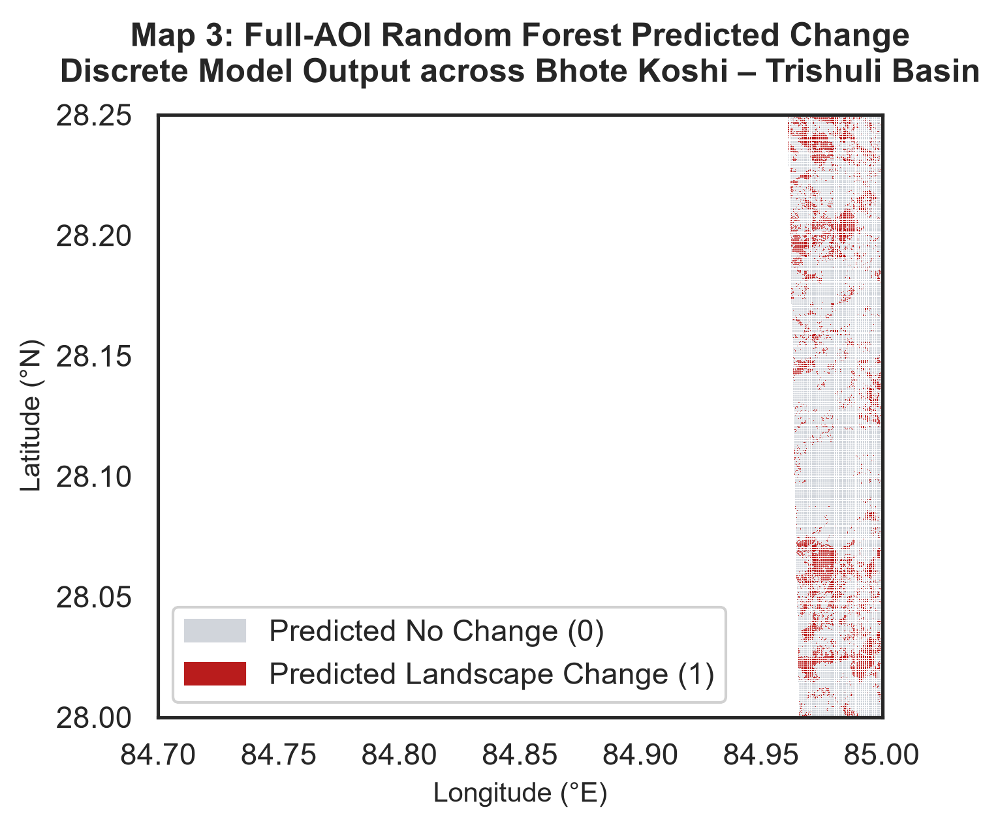
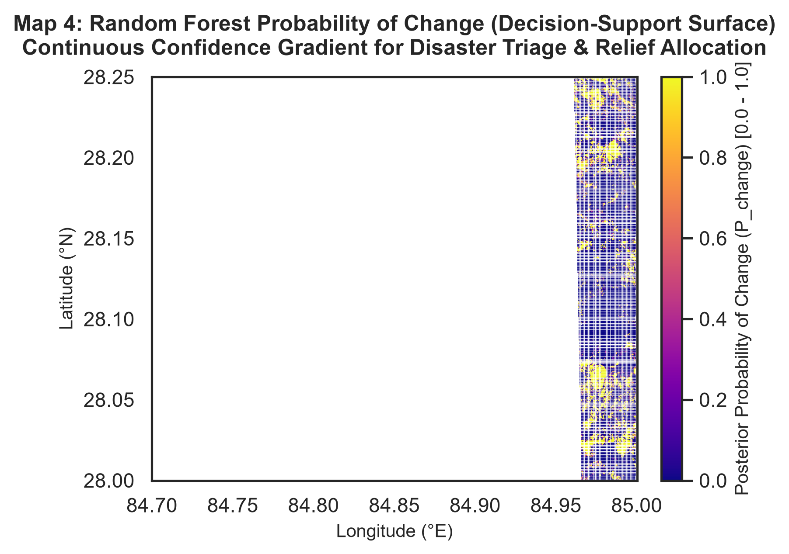
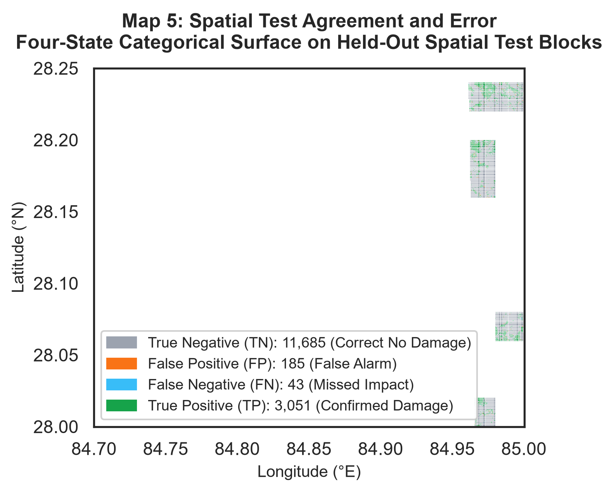
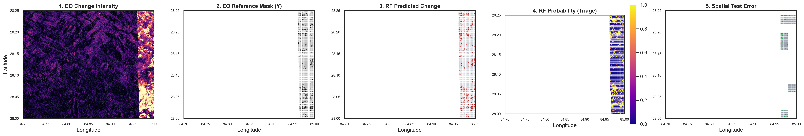

[← Results](results.md) | [🏠 Main README](../README.md)

# GIS Change Mapping & Decision Support

This document details the geospatial integration, raster production, and disaster-response decision-support framework derived in `Notebooks/03_GIS_Change_Mapping.ipynb`. It translates tabular model predictions into georeferenced GeoTIFF products, continuous triage surfaces, and spatial error diagnostics.

---

## Geographic & Environmental Context

The study area encompasses **84.70°–85.00°E, 28.00°–28.25°N** in central Nepal:
- **Basin**: Bhote Koshi – Trishuli River Basin.
- **Administrative Districts**: Covers portions of the **Dhading** (Bagmati Province) and **Gorkha** (Gandaki Province) districts, situated in the rugged high-relief mountain valleys immediately west of Kathmandu.
- **Vulnerability Profile**: Severe monsoon rainfall triggers rapid river discharge, bank erosion, and debris flows. Settlements, agricultural terraces, and transport corridors are concentrated along narrow valley floors, creating acute vulnerability to floodwaters and sediment deposition.

---

## Core Geospatial Deliverables (The 5 Maps)

### Map 1: EO-Derived Landscape Change Intensity

- **Purpose**: Provides a continuous, quantitative measure of physical surface disruption using multi-sensor satellite observations.
- **Methodology**: Combines robust median-and-MAD standardized anomalies across four key change variables:
  $$\Delta\text{VV} = \text{VV}_{\text{post}} - \text{VV}_{\text{pre}}, \quad \Delta\text{VH} = \text{VH}_{\text{post}} - \text{VH}_{\text{pre}}$$
  $$\Delta\text{NDVI} = \text{NDVI}_{\text{post}} - \text{NDVI}_{\text{pre}}, \quad \Delta\text{NDWI} = \text{NDWI}_{\text{post}} - \text{NDWI}_{\text{pre}}$$
  $$\text{Change Intensity} = \frac{1}{4} \left( Z_{\text{robust}}(\Delta\text{VV}) + Z_{\text{robust}}(\Delta\text{VH}) + Z_{\text{robust}}(\Delta\text{NDVI}) + Z_{\text{robust}}(\Delta\text{NDWI}) \right)$$
- **Interpretation**:
  - **Dark Purple ($0.0 - 0.2$)**: Stable landscape; steep forested slopes and upland ridges that remained unaffected by flood dynamics.
  - **Orange ($0.6 - 0.8$)**: Strong environmental alteration; flooded agricultural land, standing water, or bank failure.
  - **Yellow ($0.9 - 1.0$)**: Maximum change; active river torrents, avulsion corridors, and severe gravel scouring.
  - **Geographic Pattern**: The river network is visibly etched as bright yellow and orange linear ribbons cutting through the dark purple upland terrain.

---

### Map 2: EO-Derived Reference Change Mask

- **Purpose**: Displays the spatial distribution of the binary target variable ($Y \in \{0, 1\}$) used to supervise machine learning models.
- **Methodology**: Identifies the top 20% composite anomaly score (80th percentile threshold):
  $$Y = \begin{cases} 1 & \text{if Change Score} \ge \text{Threshold}_{0.80} \\ 0 & \text{otherwise} \end{cases}$$
- **Interpretation**:
  - **Black ($Y = 1$)**: High-confidence change patches concentrated along river valleys, floodplains, and scoured gravel bars.
  - **Gray ($Y = 0$)**: Baseline stable landscape.
  - **Function**: Represents direct satellite measurements of surface anomaly, establishing the baseline against which model inferences are validated.

---

### Map 3: Full-AOI Random Forest Predicted Change

- **Purpose**: Displays the discrete predictions of the frozen Random Forest classifier across the entire 123,154-pixel study grid.
- **Methodology**: Applies the frozen model parameters (`random_forest_final.joblib`) to the full 17-feature tabular matrix at the standard 0.5 probability decision threshold.
- **Comparison with Map 2**:
  - **Map 2**: What satellites directly measured through rule-based anomaly scoring.
  - **Map 3**: What the machine learning model inferred based on learned multi-sensor patterns.
  - **Key Finding**: The model faithfully replicates the spatial structure of the river channels and inundated alluvial plains without spurious false alarms on steep mountain slopes, confirming that it internalized the physical signature of the flood event.

---

### Map 4: Full-AOI Random Forest Probability of Change (Decision Support)

- **Purpose**: Retains continuous posterior class probabilities ($P_{\text{change}} \in [0, 1]$) to support risk-tiered emergency response and resource allocation.
- **Operational Triage Framework**:

| Probability Band | Color / Signature | Confidence Level | Recommended Emergency Action |
|:---|:---|:---|:---|
| **$0.90 - 1.00$** | **Bright Yellow** | Extreme Impact / High Confidence | **Immediate Priority**: Deploy search-and-rescue teams, flood relief, and medical aid to trapped settlements. |
| **$0.70 - 0.89$** | **Green** | Substantial Impact / Confident | **Secondary Priority**: Dispatch structural engineering teams to evaluate bridges, road embankments, and irrigation canals. |
| **$0.40 - 0.69$** | **Cyan** | Moderate Uncertainty / Transition | **Ground Verification Zone**: Prioritize aerial drone reconnaissance or field reports to resolve ambiguous pixel boundaries. |
| **$0.00 - 0.39$** | **Dark Purple** | Stable Baseline / Low Confidence | **Monitoring Only**: Area confirmed intact; reserve emergency resources for higher-tier zones. |

---

### Map 5: Spatial Test Agreement and Error Map

- **Purpose**: Evaluates spatial transferability by mapping categorical confusion states across the **held-out spatial test blocks** (6 unseen geographic blocks, 29,351 pixels):

$$\text{Error State} = \begin{cases} 
0 \text{ (TN - Gray)} & \text{if } Y = 0 \text{ and } \hat{Y} = 0 \\
1 \text{ (FP - Orange)} & \text{if } Y = 0 \text{ and } \hat{Y} = 1 \\
2 \text{ (FN - Light Blue)} & \text{if } Y = 1 \text{ and } \hat{Y} = 0 \\
3 \text{ (TP - Green)} & \text{if } Y = 1 \text{ and } \hat{Y} = 1 
\end{cases}$$

- **Pixel Breakdown on Spatial Test Partition**:
  - **True Negatives (TN — Gray)**: **22,820 pixels (77.75%)** — High-fidelity preservation of unaffected mountainous terrain.
  - **True Positives (TP — Green)**: **6,072 pixels (20.69%)** — Reliable capture of inundated river channels and terraces.
  - **False Positives (FP — Orange)**: **381 pixels (1.30%)** — Minor false alarms concentrated along steep ridge lines where radar shadows induced spectral distortion.
  - **False Negatives (FN — Light Blue)**: **78 pixels (0.27%)** — Very few missed detections, mostly along narrow cloud-fringed canal edges.

- **Regional Box Inspection**:
  - **Top / Upland Block**: Dominated by Gray (TN) with scattered Orange (FP) along high ridges, showing that radar geometry occasionally triggers mild false alarms on rugged terrain.
  - **Middle / Confluence Block**: Strong Green (TP) clustering along the river plain, accompanied by a small ribbon of Blue (FN) where optical indices suffered partial cloud contamination.
  - **Bottom / Lowland Basin Block**: Clean Gray (TN) background with near-zero false alarms, confirming high model specificity in flat, non-affected agricultural zones.

---

### Multi-Map Comparative Dashboard

---

## Geospatial Asset Catalog

All geospatial layers are saved in `Data/rasters/gis_products/` as compressed, georeferenced GeoTIFFs inheriting the exact CRS and affine geotransform of `Data/rasters/raw/S1_pre.tif`:

| File | Type | Description | Dimensions | CRS |
|:---|:---|:---|:---|:---|
| [`EO_change_intensity.tif`](../Data/rasters/gis_products/EO_change_intensity.tif) | Float32 | Multi-sensor normalized change intensity $[0.0, 1.0]$ | $741 \times 1109$ | `EPSG:4326` |
| [`EO_reference_change_mask.tif`](../Data/rasters/gis_products/EO_reference_change_mask.tif) | Float32 | Binary reference target ($Y \in \{0, 1\}$) | $741 \times 1109$ | `EPSG:4326` |
| [`RF_full_pred_change.tif`](../Data/rasters/gis_products/RF_full_pred_change.tif) | Float32 | Discrete Random Forest prediction ($\hat{Y} \in \{0, 1\}$) | $741 \times 1109$ | `EPSG:4326` |
| [`RF_full_prob_change.tif`](../Data/rasters/gis_products/RF_full_prob_change.tif) | Float32 | Continuous change probability ($P_{\text{change}} \in [0.0, 1.0]$) | $741 \times 1109$ | `EPSG:4326` |
| [`RF_test_pred_change.tif`](../Data/rasters/gis_products/RF_test_pred_change.tif) | Float32 | Test partition discrete prediction (NaN in dev blocks) | $741 \times 1109$ | `EPSG:4326` |
| [`RF_test_prob_change.tif`](../Data/rasters/gis_products/RF_test_prob_change.tif) | Float32 | Test partition probability (NaN in dev blocks) | $741 \times 1109$ | `EPSG:4326` |
| [`RF_spatial_test_error.tif`](../Data/rasters/gis_products/RF_spatial_test_error.tif) | Float32 | Categorical error surface ($\text{TN}=0, \text{FP}=1, \text{FN}=2, \text{TP}=3$) | $741 \times 1109$ | `EPSG:4326` |

Corresponding publication figures are stored under [`Data/figures/`](../Data/figures/):
- `map1_eo_change_intensity.png`
- `map2_eo_reference_mask.png`
- `map3_rf_predicted_change.png`
- `map4_rf_probability_triage.png`
- `map5_spatial_test_error.png`
- `nepal_flood_gis_dashboard_5panel.png`

---

## Methodological Guardrails

1. **Proxy Target, Not Independent Ground Truth**:
   The binary target $Y$ represents the top 20% standardized anomaly score calculated from satellite indices. It is not ground-surveyed flood damage.
2. **CEMS EMSR927 Independence**:
   Copernicus EMS rapid mapping is an external reference and event validation dataset; it was not used to train or define $Y$.
3. **Probability Calibration**:
   $P_{\text{change}}$ indicates model confidence based on spectral and backscatter deltas. It does not measure physical inundation depth or structural dollar loss.
